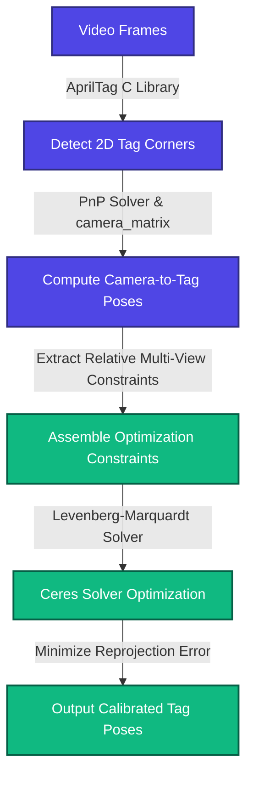

# Least Squares Solve

When the user clicks the "Calibrate!!!" button, WPICal launches the optimization process. This stage reads the video frames, detects visual markers, and runs a global solver to compute the most mathematically likely positions of the AprilTags.

## AprilTag Pose Extraction

Within the solver loop, WPICal processes the video files frame-by-frame:

1. **Detection:** The tool runs the standard AprilTag C library to detect 2D tag corners in each image frame.
2. **Pose Estimation:** Using the camera intrinsics matrix ($\mathbf{K}$), it solves the Perspective-n-Point (PnP) problem to find the 3D translation vector and rotation matrix from the camera to the tag.
3. **Constraint Generation:** Whenever two or more tags are visible in the same frame, the relative 3D coordinate transformation between those tags is logged as a mathematical constraint.

## Ceres Solver Optimization

WPICal aggregates these relative transformations across all processed frames to construct a non-linear least squares optimization problem.

* **Parameterization:** The variables in the optimization are the 3D positions ($x, y, z$) and rotations (represented as quaternions to avoid gimbal lock) of the unpinned tags.
* **Objective Function:** The solver minimizes the reprojection error: the distance between the observed 2D corners of the tags in the video frames and the projected 3D positions of the tags based on the current solver parameters.
* **Solver Execution:** The Ceres Solver library performs Levenberg-Marquardt optimization iterations. It adjusts the tag poses until the overall error converges to a local minimum, effectively finding the tag positions that best fit the multi-view visual evidence.

